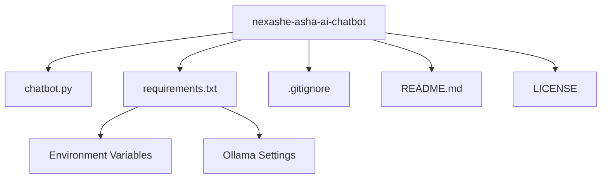

# NexaShe-s-Asha-AI-chatbot
NexaShe's Asha AI Chatbot
Asha is an AI-powered chatbot developed for the JobsForHer Foundation to empower women in their career journeys. Built with Streamlit, it provides job listings, career resources, event information, resume building, and personalized career guidance through an intuitive web interface. The chatbot integrates with the JobsForHer API (or uses sample data) and leverages a local Ollama model (Llama 3.2) for natural language processing.
Features

Interactive Chat: Engage with Asha via text or voice to get answers about job listings, events, career advice, and more.
Predefined Questions: Quickly access common queries like "Show me job listings" or "What are upcoming events?".
Resume Builder: Generate professional resumes in Markdown format based on user profiles or upload existing resumes for analysis.
User Profile Management: Store personal details, skills, education, and work history for tailored responses.
Multilingual Voice Support: Use speech-to-text for input and text-to-speech for output in languages like English, Hindi, Tamil, and more.
Contact Form: Submit inquiries to the JobsForHer team.
Bias Prevention: Detects and redirects biased queries to promote inclusivity.
API Integration: Fetches real-time job listings, events, and resources from the JobsForHer API (or uses sample data if API credentials are unavailable).
Response Caching: Enhances performance by caching API data and chatbot responses.

Prerequisites

Python: Version 3.10 or 3.11 (recommended for compatibility; Python 3.13 may have issues with some dependencies).
Ollama: A local instance running the Llama 3.2 model for natural language processing.
Dependencies: Listed in the Installation section.
Optional: JobsForHer API credentials for live data integration.
Windows Users: Install ffmpeg for audio processing (see Installation).

Installation

Clone the Repository:
git clone https://github.com/your-username/nexashe-asha-ai-chatbot
cd nexashe-asha-ai-chatbot

Set Up a Virtual Environment:
python -m venv venv
.\venv\Scripts\activate  # On Windows
source venv/bin/activate  # On macOS/Linux

Install Dependencies:
pip install -r requirements.txt

Install Ollama:

Download and install Ollama from ollama.ai.
Pull and run the Llama 3.2 model:ollama run llama3.2

Configure Environment Variables:

Create a .env file in the project root:JFH_API_BASE_URL=https://api.jobsforher.com/v1
JFH_API_KEY=your_api_key
JFH_API_SECRET=your_api_secret
OLLAMA_API_URL=http://localhost:11434/api/generate
OLLAMA_MODEL=llama3.2

If you don’t have JobsForHer API credentials, the app will use sample data (data/job_listing_data.csv and data/session_details.json).

Sample Data (Optional):

Ensure the data/ directory contains:
job_listing_data.csv: Sample job listings.
session_details.json: Sample event data.

If these files are missing, the app uses hardcoded sample data.

Usage

Run the Application:
streamlit run app.py

Open your browser to http://localhost:8501 to access the app.

Navigate the Interface:

Chat with Asha: Use the chat input or predefined questions to ask about jobs, events, or career advice. Enable voice input/output in the sidebar.
My Profile: Enter personal details, skills, education, and work history for personalized responses.
Resume Builder: Generate a Markdown resume based on your profile or upload an existing resume for analysis.
Contact Us: Submit inquiries to the JobsForHer team.

Testing:

Test predefined questions (e.g., "Show me job listings") for instant responses.
Complete your profile, generate a resume, and download it as a .md file.
Use voice input to submit queries and verify text-to-speech output.
Submit a contact form to ensure it processes correctly.

# Nexashe ASHA AI Chatbot

## Project Structure

Contributing
Contributions are welcome! Please follow these steps:

Fork the repository.
Create a new branch (git checkout -b feature/your-feature).
Make your changes and commit (git commit -m "Add your feature").
Push to the branch (git push origin feature/your-feature).
Open a pull request.

Please ensure your code follows PEP 8 style guidelines and includes appropriate tests.
License
This project is licensed under the MIT License. See the LICENSE file for details.

NexaShe's Asha AI Chatbot is designed to empower women in their career journeys. We hope you find it valuable!
